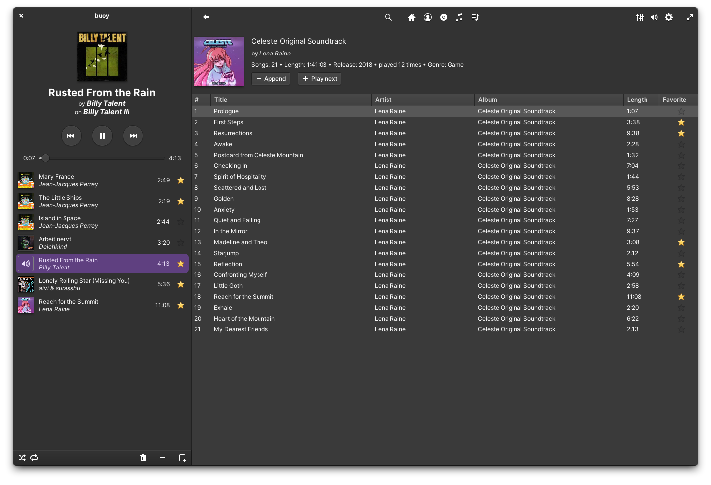

# buoy

**buoy is a music client for a subsonic server written with rust and GTK4 designed for elementary OS.**

---

## Building and running

Install the needed depencies:

```bash
sudo apt install libgtk-4-dev libgranite-7-dev libgstreamer1.0-dev
```

it is assumed, that rust is already installed.

```bash
cargo build --release
cargo run --release
```

## Screenshot


