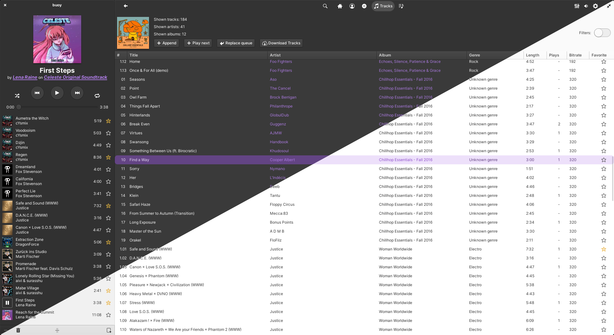
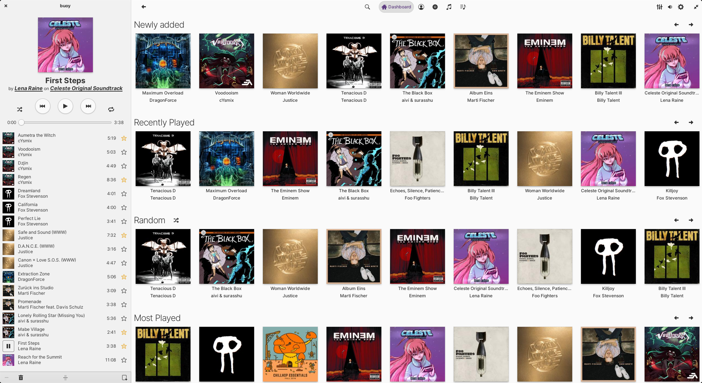
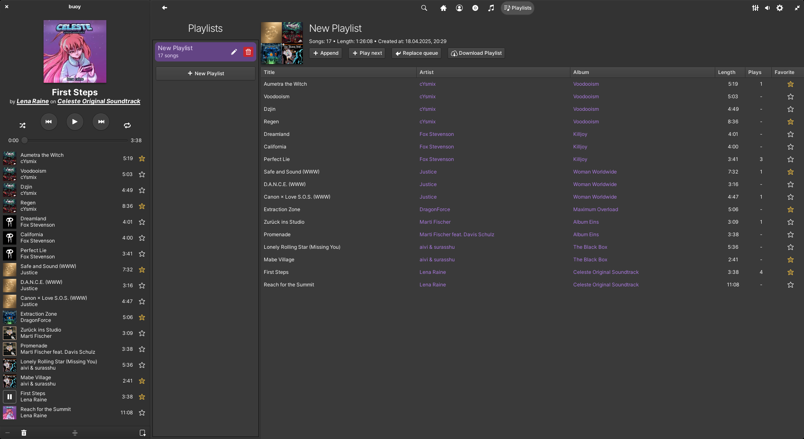

# buoy

**buoy is a music client for a subsonic server written with rust and GTK4 designed for elementary OS.**

---

## Screenshots





## First Setup

Install the needed dependencies (assuming rust is already installed)

```bash
sudo apt install libgtk-4-dev libgranite-7-dev libgstreamer1.0-dev meson git gettext desktop-file-utils
```

and clone the repository with

```bash
git clone https://github.com/eppixx/buoy
cd buoy
```

## Installing the release version

### Installing with meson

It can be installed with the following commands
```bash
meson setup build-release --buildtype=release
ninja -C build-release install # installing will ask for the superuser password
```

It can now be run from the desktop launcher or from the terminal with
```
buoy
```

### Installing with flatpak

Fetch the flatpak dependencies
```bash
flatpak --user install -y --noninteractive io.elementary.Platform/x86_64/8 io.elementary.Sdk/x86_64/8
```

Building the project
```bash
flatpak-builder --user flatpak_app com.github.eppixx.buoy.json buoy --force-clean
```

Run the build version without installing with
```bash
flatpak-builder --run flatpak_app com.github.eppixx.buoy.json buoy
```

Install the local version with
```bash
flatpak-builder --user --install flatpak_app com.github.eppixx.buoy.json --force-clean

```

It should now be able to run with a program launcher or from command line with
```bash
flatpak run com.github.eppixx.buoy
```

## Developing

### Build debug version

Build with the following commands
```bash
meson setup build
ninja -C build
```

Run with
```bash
./build/src/debug/buoy
```

### Updating the translations

When adding a new file that contains the `gettext` function it needs to be added to `po/POTFILES`.
Now you can update the translation files with
```bash
ninja -C build com.github.eppixx.buoy-update-po
```
and update the po files with new translations.

#### Updating `cargo-sources.json`

When changing `Cargo.toml` `cargo-sources.json` needs to be updated for the flatpak version with
```bash
sudo apt install python3-aiohttp python3-toml
wget https://raw.githubusercontent.com/flatpak/flatpak-builder-tools/master/cargo/flatpak-cargo-generator.py
python3 ./flatpak-cargo-generator.py Cargo.lock -o cargo-sources.json
```
