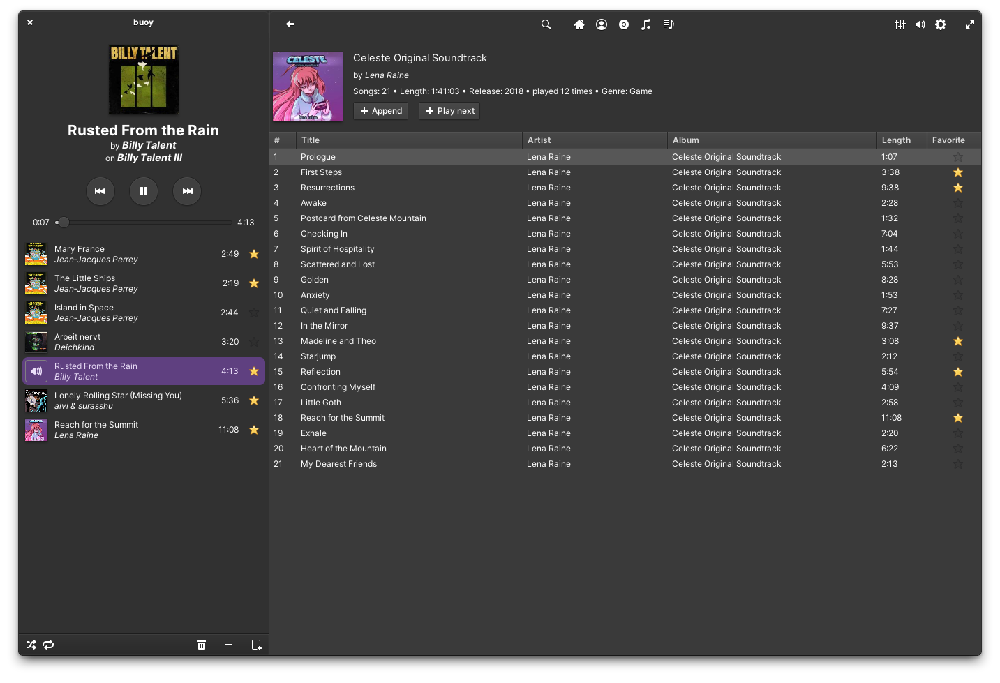

# buoy

**buoy is a music client for a subsonic server written with rust and GTK4 designed for elementary OS.**

---

## Screenshot



## Develop and install with meson and ninja
### Install the needed depencies

```bash
sudo apt install libgtk-4-dev libgranite-7-dev libgstreamer1.0-dev
```

it is assumed, that rust is already installed.


### Developing

Build with the following
```bash
meson setup build
cd build
ninja
```

Run with
```bash
./src/debug/buoy
```

#### Updating `cargo-sources.json`

When changing `Cargo.toml` `cargo-sources.json` needs to be updated for the flatpak version with
```bash
sudo apt install python3-aiohttp python3-toml
wget https://raw.githubusercontent.com/flatpak/flatpak-builder-tools/master/cargo/flatpak-cargo-generator.py
python3 ./flatpak-cargo-generator.py Cargo.lock -o cargo-sources.json
```

### Building and installing the release version

It can be installed with the following commands
```bash
meson setup build-release --buildtype=release
cd build-release
ninja install
```

It can now be run from the desktop launcher or with
```
buoy
```

## Building and installing with flatpak

Fetch the flatpak dependencies
```bash
flatpak --user install -y --noninteractive io.elementary.Platform/x86_64/8 io.elementary.Sdk/x86_64/8
```

Building the project
```bash
flatpak-builder --user flatpak_app com.github.eppixx.buoy.json buoy --force-clean
```

Run the build version without installing with
```bash
flatpak-builder --run flatpak_app com.github.eppixx.buoy.json buoy
```

Install the local version with
```bash
flatpak-builder --user --install flatpak_app com.github.eppixx.buoy.json --force-clean

```

It should now be able to run with a program launcher or from command line with
```bash
flatpak run com.github.eppixx.buoy
```


